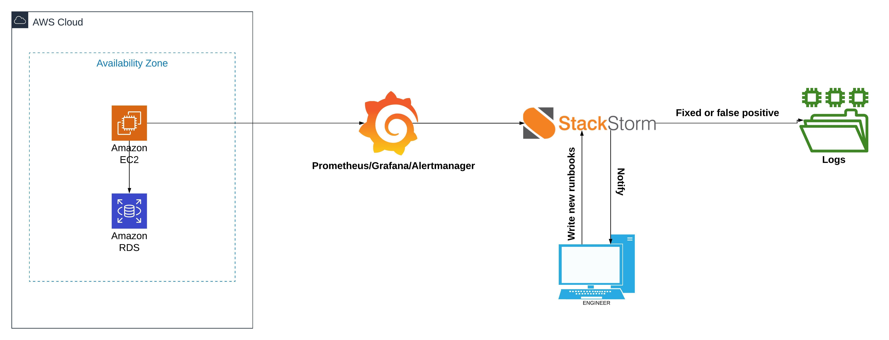

# Auto-remediation and Event Driven Automation
A study estimated that 96% of alerts generated by monitoring tools are either false positives or could be resolved by automation. This project will try to solve this problem by automating the repair of any infrastructure using monitoring and stackstrorm

This project was developed by [Ronaldo Lauture](https://www.linkedin.com/in/ronaldo-lauture-08934a59/) during his tenure as a DevOps Engineering Fellow at [Insight](https://www.insightdevops.com/). The capabilities of this project have been demonstrated by completly destroying an EC2 instance as an example. Ronaldo's presentation slides with a short demo is available [here](https://docs.google.com/presentation/d/1OrvwadiH-WYRtB_8sGYmyPx6CZl8urtcpWVMj38T-D8/edit?usp=sharing).

----
### Prerequesites 
- [AWS CLI](https://docs.aws.amazon.com/cli/latest/userguide/cli-chap-install.html)
- [Terraform](https://www.terraform.io/downloads.html)

----
### Quick Start
Install the prerequesites first and configure them.
```sh
git clone https://github.com/highlloyd/auto-remediation.git && cd auto-remediation/ | sh install.sh
```
----
### 1.0 Tech Stack

| Technology | Use Case |
| :---: | :---- |
| Terraform | automate infrastructure |
| Docker | application containers |
| Bash| automating the deployment of the application |
| Prometheus / Grafana/ Alertmanager | monitoring setup |
| Stackstorm | Event-driven automation |



### 2.0 Monitoring

An important part of any auto-remediation system is the monitoring stack, here we use Prometheus with grafana. The metrics are extracted with Node exporter for system informations, Blackbox to probes endpoints over various protocols and finally container-exporter to send informations about our running containers. All the alerts are sent via webhook by alertmanager to our stackstorm instance.
 
  - prometheus
  - alertmanager
  - node-exporter
  - container-exporter
  - grafana
  - Blackbox
### 3.0 If this then that OPS
Stackstorm ........

-Components
-...
-...

### 4.0 Example
 
